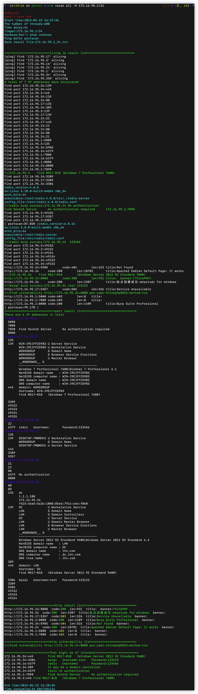
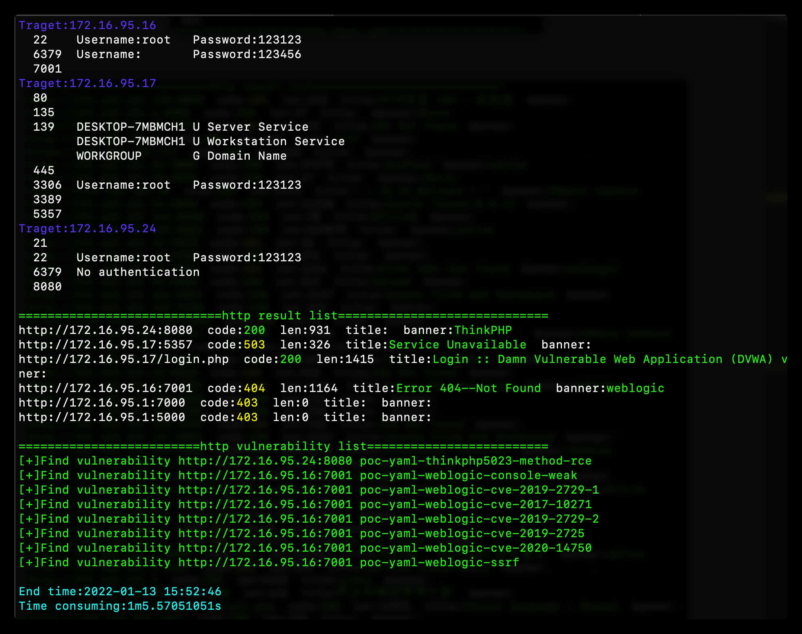
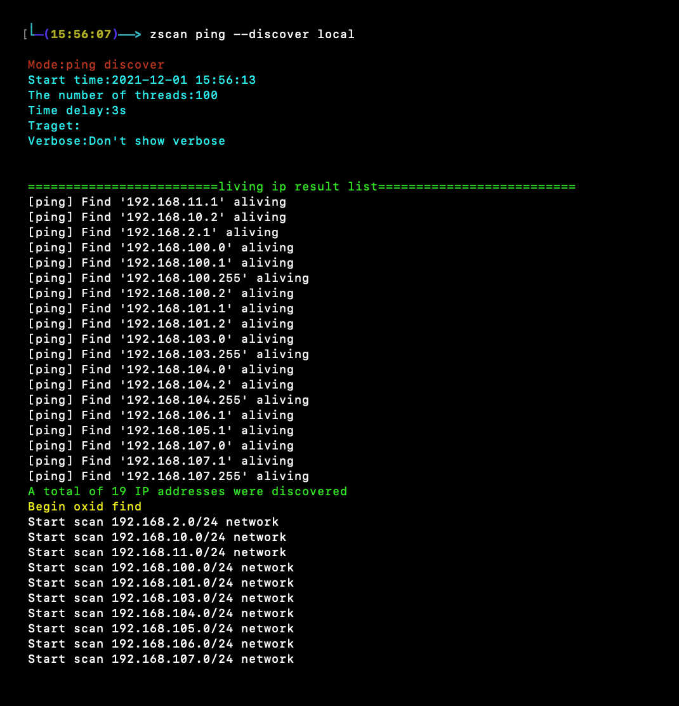
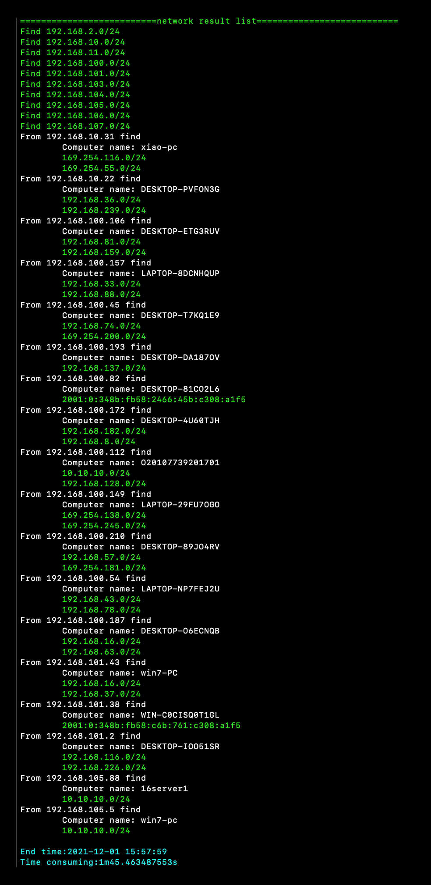
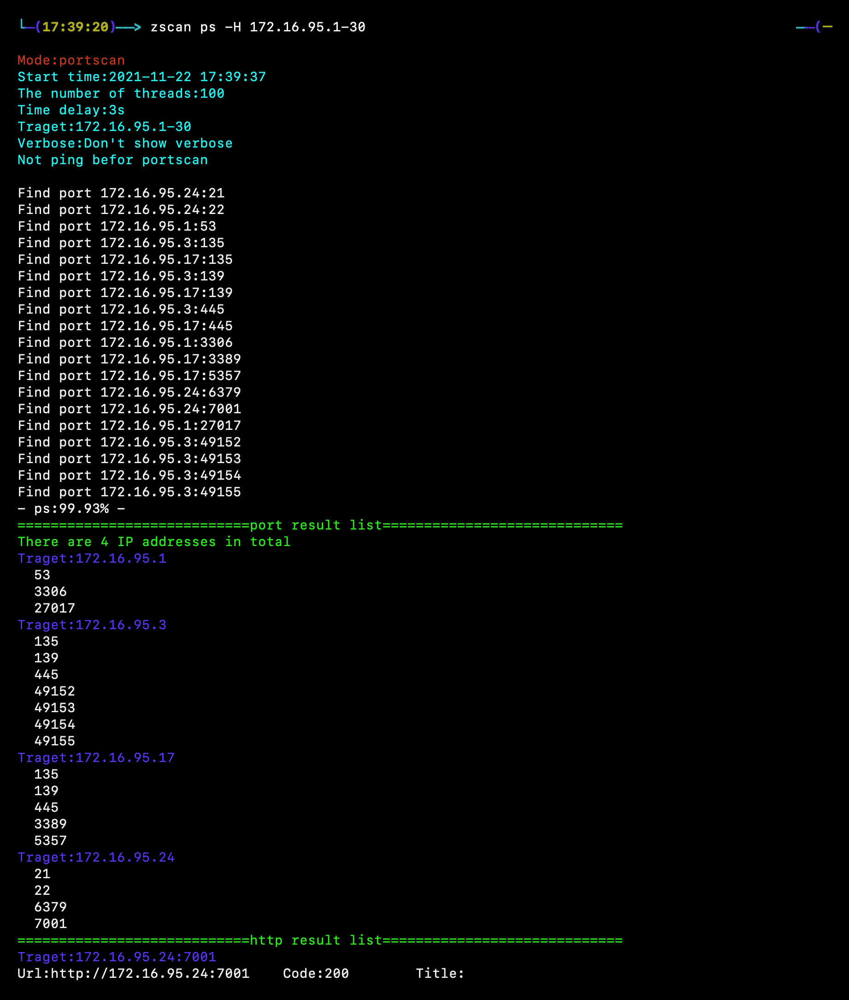
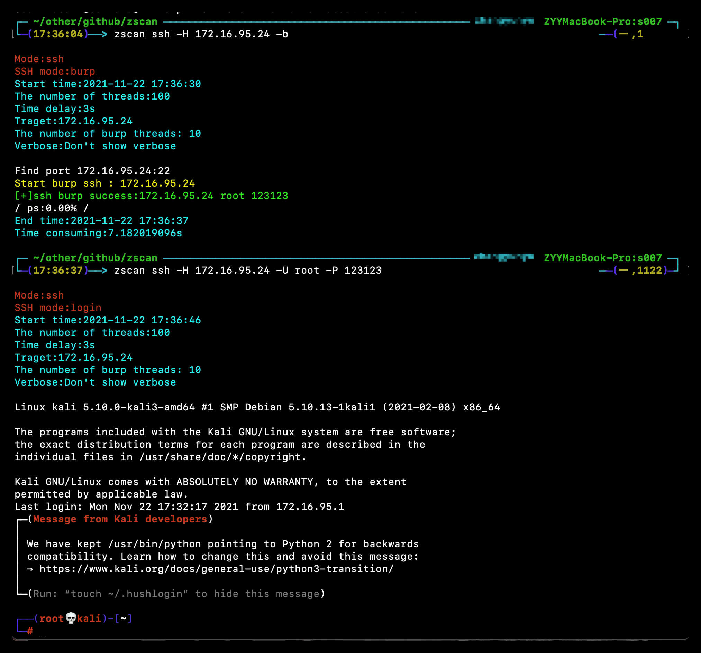
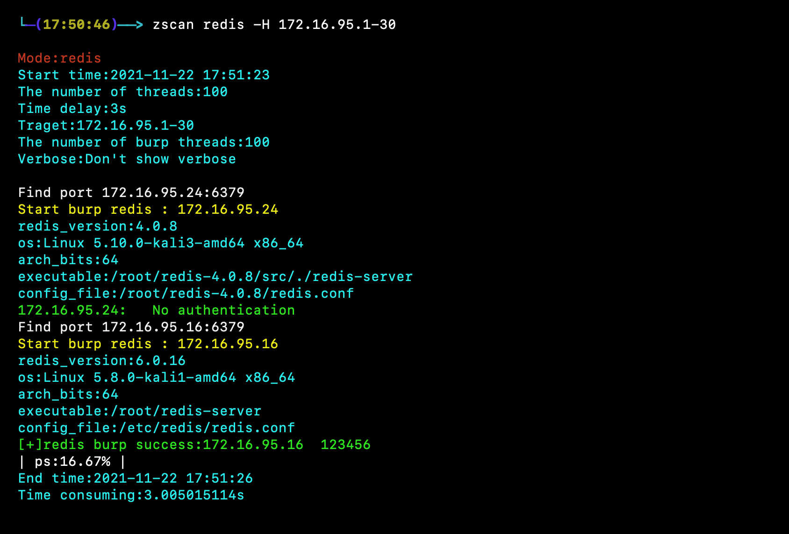
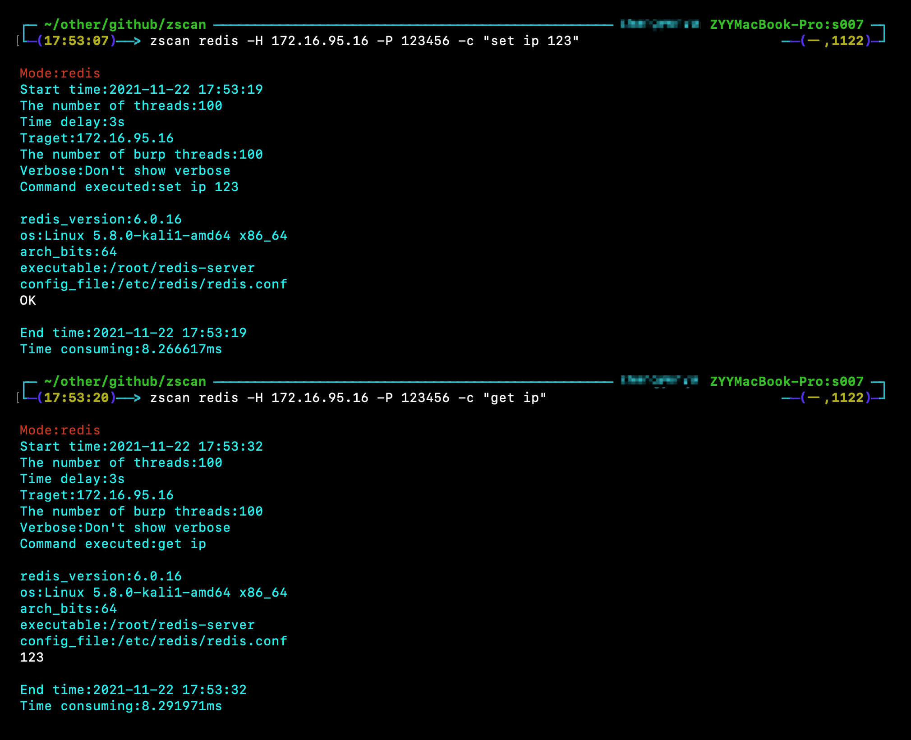
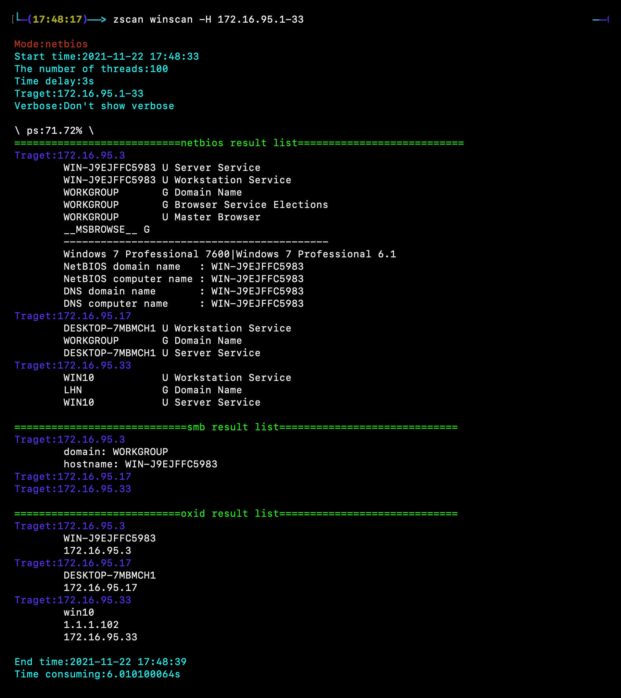
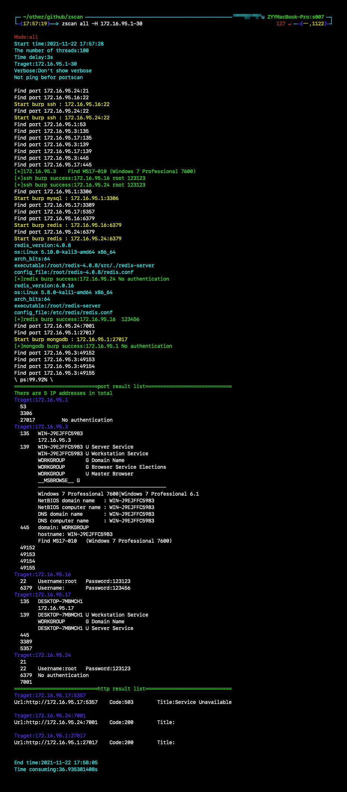

#              Zscan a scan blasting tool set
[](https://github.com/zyylhn/zscan/blob/master/LICENSE)
[](https://github.com/zyylhn/zscan/releases/tag/1.4.1)
[](https://github.com/zyylhn/zscan)

📄[English document](https://github.com/zyylhn/zscan/blob/master/README_EN.md)

更新内容见日志[log](https://github.com/zyylhn/zscan/blob/master/update.log)


<details>
<summary><b>结果输出格式</b></summary>
-输出的部分结果截图





</details>


## 简介🎉


​	Zscan是一个开源的内网端口扫描器、爆破工具和其他实用工具的集合体可以称为工具包。以主机和内网网段发现和端口扫描为基础，可以对mysql、mssql、redis、mongo、postgres、ftp、ssh、ldap等服务进行爆破，还有其他netbios、smb、oxid、socks server（扫描内网中的代理服务器）、snmp、ms17010等扫描功能，支持poc（xray v1格式）单个和批量检测。每个模块还有其独特的功能例如ssh还支持用户名密码和公钥登录，支持使用ssh私钥遍历主机，所有服务爆破成功之后还可以执行命令（后期会增加服务利用功能例如redis的rce等等）。除了基本的扫描和服务爆破功能之外，还支持webtitle抓取和指纹识别，zscan还集成了nc模块（连接和监听）、httpserver模块（支持下载文件、上传文件和身份验证）、socks5模块（启动一个代理服务器）。还存在all模块，在扫描的过程中会调用其他所有的扫描和爆破模块。内置代理功能。

工具体积较大，后期会出精简版

使用格式为

```
zscan 模块 参数
```

```
 ______     ______     ______     ______     __   __    
/\___  \   /\  ___\   /\  ___\   /\  __ \   /\ "-.\ \   
\/_/  /__  \ \___  \  \ \ \____  \ \  __ \  \ \ \-.  \  
  /\_____\  \/\_____\  \ \_____\  \ \_\ \_\  \ \_\\"\_\ 
  \/_____/   \/_____/   \/_____/   \/_/\/_/   \/_/ \/_/

Usage:
  zscan [command]

Available Commands:
  all         Use all scan mode
  completion  generate the autocompletion script for the specified shell
  ftp         burp ftp username and password 
  help        Help about any command
  httpserver  Start an authentication HTTP server
  ldap        burp ldap and query
  mongo       burp mongodb username and password
  ms17010     MS17_010 scan
  mssql       burp mssql username and password
  mysql       burp mysql username and password
  nc          A easy nc
  ping        ping scan to find computer
  poc         poc check
  postgres    burp postgres username and password
  proxyfind   Scan proxy
  ps          Port Scan
  rdp         burp remote desktop（3389）
  redis       burp redis password
  snmp        snmp scan
  socks5      Create a socks5 server
  ssh         ssh client support username password burp
  version     Show version of zscan
  winscan     netbios、smb、oxid scan

Flags:
  -h, --help            help for zscan
      --nobar           disable portscan progress bar
  -o, --output string   the path of result file (default "result.txt")
      --proxy string    Connect with a proxy(user:pass@172.16.95.1:1080 or 172.16.95.1:1080)
  -T, --thread thread   Set thread eg:2000 (default 600)
  -t, --timeout time    Set timeout(s) eg:5s (default 5s)
  -v, --verbose         Show verbose information


```
模块里面的Flag代表当前命令的参数，Global Flags代表全局参数（所有命令都可以用）
这里的Flags为全局参数，所有模块都可以使用
- --log：启用这个参数会将当前运行结果以追加的形式写到log.txt（可以记下每次运行的结果）
- -o --output：默认在当前目录的中文件名为Hosts -o指定路径
- --proxy ：设置代理，用户名密码（user:pass@ip:port）不需要省份验证（ip:port）
- -T --thread：指定线程数，默认100
- -t --timeout：设置延时，网络条件好追求速度的话可以设置成1s
- -v --verbose：设置显示扫描过程信息

## 功能模块😈

目前已有模块：

<details>
<summary><b>ping模块:普通用户权限调用系统ping，root权限可以选择使用icmp数据包</b></summary>

```
zscan ping 
```

```
Usage:
  zscan ping [flags]

Flags:
  -d, --discover string   Live network segment found
  -h, --help              help for ping
  -H, --host hosts        Set hosts(The format is similar to Nmap)
      --hostfile string   Set host file
  -i, --icmp              Icmp packets are sent to check whether the host is alive(need root)

Global Flags:
      --log             Record the scan results in chronological order，Save path./log.txt
  -O, --output          Whether to enter the results into a file（default ./result.txt),can use --path set
      --path string     the path of result file (default "result.txt")
      --proxy string    Connect with a proxy(user:pass@172.16.95.1:1080 or 172.16.95.1:1080)
  -T, --thread thread   Set thread eg:2000 (default 100)
  -t, --timeout time    Set timeout(s) eg:5s (default 3s)
  -v, --verbose         Show verbose information


```

三个参数，必须指定host和hostfile两个参数其中的一个，当有root权限的时候可以使用-i不调用本地的ping而是自己发icmp数据包（线程开的特别高的话几千那种，调用本地ping命令会导致cpu占用过高）

--discover两种网段发现模式，一种是ping网络b段网关，一种是oxid扫描

--discover后面需要给一个参数，如果给local（zscan ping --disconver local）就会读取本地网卡信息，去扫描本地的网络b段，例如读取到本地的两张网卡192.168.13.13和172.16.95.23，那么他就会去ping192.168.0.0/16和172.16.0.0/16这两个b段

还可以给定一个或者多个b段ip例如172.17.0.0或者172.18.0.0,10.10.0.0，多个ip段用逗号隔开

</details>

<details>
<summary><b>ps模块:端口扫描和获取httptitle</b></summary>

```
zscan ps
```

```
Port Scan

Usage:
  zscan ps [flags]

Flags:
  -b, --banner            Return banner information
  -h, --help              help for ps
  -H, --host hosts        Set hosts(The format is similar to Nmap) eg:192.168.1.1/24,172.16.95.1-100,127.0.0.1
      --hostfile string   Set host file
  -i, --icmp              Icmp packets are sent to check whether the host is alive(need root)
      --noping            not ping discovery before port scanning
      --nowebscan         Whether to perform HTTP scanning (httpTitle and HTTP vulnerabilities)(default on)
  -p, --port port         Set port eg:1-1000,3306,3389 (default)
  -s, --syn               use syn scan
      --vulscan           Whether to perform HTTP vulnerabilities(default off)

Global Flags:
      --nobar           disable portscan progress bar
  -o, --output string   the path of result file (default "result.txt")
      --proxy string    Connect with a proxy(user:pass@172.16.95.1:1080 or 172.16.95.1:1080)
  -T, --thread thread   Set thread eg:2000 (default 600)
  -t, --timeout time    Set timeout(s) eg:5s (default 5s)
  -v, --verbose         Show verbose information

```

--host和--hostfile指定目标

-p指定端口，不指定的话使用默认端口

--ping在端口扫描之前先进行ping主机发现

--icmp在使用ping的时候使用icmp包进行主机发现

--nowebscan 参数用来禁止开启web扫描只做端口扫描

--vulscan 参数用来开启poc探测（只有web扫描开启的时候才能使用，不然没有意义）

</details>

<details>
<summary><b>all模块:调用所有扫描和爆破模块进行扫描</b></summary>

```
zscan all
```

```
Use all scan mode

Usage:
  zscan all [flags]

Flags:
  -h, --help              help for all
  -H, --host hosts        Set hosts(The format is similar to Nmap) eg:192.168.1.1/24,172.16.95.1-100,127.0.0.1
      --hostfile string   Set host file
  -i, --icmp              Icmp packets are sent to check whether the host is alive(need root)
      --noping             Not ping before port scanning
      --notburp           Set postgres passworddict path
      --novulscan         disable http vulnerability scan
      --passdict string   Set postgres passworddict path
  -P, --password string   Set postgres password
  -p, --port port         Set port eg:1-1000,3306,3389 

Global Flags:
      --nobar           disable portscan progress bar
  -o, --output string   the path of result file (default "result.txt")
      --proxy string    Connect with a proxy(user:pass@172.16.95.1:1080 or 172.16.95.1:1080)
  -T, --thread thread   Set thread eg:2000 (default 600)
  -t, --timeout time    Set timeout(s) eg:5s (default 5s)
  -v, --verbose         Show verbose information

```

all模块本质是和ps模块基本相同，只不过all模块扫到对应的端口的时候会在当前线程中进行指纹识别或者用户名密码爆破

all模块参数和ps模块相同，就多了一个密码字典，是用来设置扫到需要爆破的端口时候的字典，其他都一样

--notburp 不进行爆破只进行扫描

--novulscan 由于all模块会调用所有模块，这个参数用于禁止漏洞扫描

有一个--notburp参数，调用all模块的时候只进行扫描不进行爆破

</details>

<details>
<summary><b>ssh模块:用户名密码爆破，ssh用户名密码登录，公钥登录</b></summary>

```
zscan ssh
```

```
Usage:
  zscan ssh [flags]

Flags:
  -b, --burp              Use burp mode default login mode
  -h, --help              help for ssh
  -H, --host string       Set ssh server host
      --hostfile string   Set host file
  -d, --keypath string    Set public key path
  -k, --login_key         Use public key login
      --passdict string   Set ssh passworddict path
  -P, --password string   Set ssh password
  -p, --port int          Set ssh server port (default 22)
      --userdict string   Set ssh userdict path
  -U, --username string   Set ssh username

Global Flags:
      --log             Record the scan results in chronological order，Save path./log.txt
  -O, --output          Whether to enter the results into a file（default ./result.txt),can use --path set
      --path string     the path of result file (default "result.txt")
  -T, --thread thread   Set thread eg:2000 (default 100)
  -t, --timeout time    Set timeout(s) eg:5s (default 3s)
  -v, --verbose         Show verbose information
```

登陆模块（默认）

​	账号密码登陆：./zscan ssh -H 172.16.95.24 -U root -P 123456

​	公钥登陆：./zscan ssh -H 172.16.95.24 -U root -k 

​	公钥登陆默认会去当前用户目录下面的./ssh取私钥，可以使用-d/--keypath指定私钥路径

爆破模块（-b/--burp参数）

​	用户名：可以使用-U/--username指定用户名、--userdict指定用户名字典、不指定使用内部用户名（admin，root，ssh）

​	密码：可以使用-P/--password指定密码、--passdict指定密码文件、不指定使用内部密码字典

​	eg：./zscan_linux ssh -H 172.16.95.1-30 -U root -b --passdict 1.txt 

​	使用ssh私钥遍历主机需要同时指定-U，-b，-k，-d

​	eg：./zscan ssh -H 172.16.95.1-24 -U root -k -b -d ~/.ssh/id_rsa
</details>

<details>
<summary><b>mysql/mssql/mongo/redis/postgres/ftp/rdp模块:用户名密码爆破和执行简单命令</b></summary>

以mysql为例，数据库的操作基本山都一样

```
Usage:
  zscan mysql [flags]

Flags:
      --burpthread int    Set burp password thread(recommend not to change) (default 100)
  -c, --command string    Set the command you want to sql_execute
  -h, --help              help for mysql
  -H, --host string       Set mysql server host
      --hostfile string   Set host file
      --passdict string   Set mysql passworddict path
  -P, --password string   Set mysql password
  -p, --port int          Set mysql server port (default 3306)
      --userdict string   Set mysql userdict path
  -U, --username string   Set mysql username

Global Flags:
      --log             Record the scan results in chronological order，Save path./log.txt
  -O, --output          Whether to enter the results into a file（default ./result.txt),can use --path set
      --path string     the path of result file (default "result.txt")
  -T, --thread thread   Set thread eg:2000 (default 100)
  -t, --timeout time    Set timeout(s) eg:5s (default 3s)
  -v, --verbose         Show verbose information
```

这里面存在一个新的线程参数是burptheard，这个线程和-T的线程不同，-T的线程代表我们并发扫描的目标数量（这个目标是ip和端口的组合，每次并发相当于对目标发送了一个数据包），burptheard代表当我们在上面的并发扫描的单个线程中发现了我们的目标端口例如mysql，他会在当前的扫描线程中开启一个多线程爆破（这里的目标换成了特定ip特定的一个端口，这里就需要进行限速，速度太快可能导致目标服务不可用）

可以使用-c来指定要执行的命令，rdp模块只能爆破

</details>

<details>
<summary><b>proxyfind模块:扫描网络中的代理，目前支持socks4/5，后期添加http</b></summary>

```
zscan proxyfind
```

```
Usage:
  zscan proxyfind [flags]

Flags:
  -h, --help              help for proxyfind
  -H, --host hosts        Set hosts(The format is similar to Nmap) eg:192.168.1.1/24,172.16.95.1-100,127.0.0.1
      --hostfile string   Set host file
  -p, --ports port        Set port eg:1-1000,3306,3389 (default "1080,1089,8080,7890,10808")
      --type string       Set the scan proxy type(socks4/socks5/http) (default "socks5")

Global Flags:
      --log             Record the scan results in chronological order，Save path./log.txt
  -O, --output          Whether to enter the results into a file（default ./result.txt),can use --path set
      --path string     the path of result file (default "result.txt")
  -T, --thread thread   Set thread eg:2000 (default 100)
  -t, --timeout time    Set timeout(s) eg:5s (default 3s)
  -v, --verbose         Show verbose information
```

扫描内网中的代理服务器

-H 指定目标，-p指定端口，--type指定扫描的代理协议类型（目前支持socks4/5，其他协议还在努力中）
</details>

<details>
<summary><b>ms17010模块:ms17010漏洞批量扫描</b></summary>

```
Usage:
  zscan ms17010 [flags]

Flags:
  -h, --help              help for ms17010
  -H, --host string       Set target
      --hostfile string   Set host file

Global Flags:
      --log             Record the scan results in chronological order，Save path./log.txt
  -O, --output          Whether to enter the results into a file（default ./result.txt),can use --path set
      --path string     the path of result file (default "result.txt")
  -T, --thread thread   Set thread eg:2000 (default 100)
  -t, --timeout time    Set timeout(s) eg:5s (default 3s)
  -v, --verbose         Show verbose information
```

只需要指定目标即可
</details>

<details>
<summary><b>snmp模块:snmp扫描</b></summary>
```
Usage:
  zscan snmp [flags]
```
Flags:
      --burpthread int        Set burp password thread(recommend not to change) (default 100)
      --get string            set an oid
  -h, --help                  help for snmp
  -H, --host string           Set target
      --hostfile string       Set host file
  -l, --listoid               List commonly used OIDs
      --password string       set a password (default "public")
      --passwordfile string   passwords dict file, eg: ./dict/password.txt
  -p, --port port             Set port (default 161)
      --version string        specifies SNMP version to use. 1|2c|3  (default "2c")
      --walk string           set an oid
```
Global Flags:
      --log             Record the scan results in chronological order，Save path./log.txt
  -O, --output          Whether to enter the results into a file（default ./result.txt),can use --path set
      --path string     the path of result file (default "result.txt")
  -T, --thread thread   Set thread eg:2000 (default 100)
  -t, --timeout time    Set timeout(s) eg:5s (default 3s)
  -v, --verbose         Show verbose information
```

--listoid列出常见的查询信息

```
0: 系统基本信息         SysDesc                 GET     1.3.6.1.2.1.1.1.0
1: 监控时间             sysUptime               GET     1.3.6.1.2.1.1.3.0
2: 系统联系人           sysContact              GET     1.3.6.1.2.1.1.4.0
3: 获取机器名           SysName                 GET     1.3.6.1.2.1.1.5.0
4: 机器所在位置         SysLocation             GET     1.3.6.1.2.1.1.6.0
5: 机器提供的服务       SysService              GET     1.3.6.1.2.1.1.7.0
6: 系统运行的进程列表   hrSWRunName             WALK    1.3.6.1.2.1.25.4.2.1.2
7: 系统安装的软件列表   hrSWInstalledName       WALK    1.3.6.1.2.1.25.6.3.1.2
8: 网络接口列表         ipAdEntAddr             WALK    1.3.6.1.2.1.4.20.1.1
```


可以通过使用--walk和--get进行查询

密码不指定的话默认使用public

</details>

<details>
<summary><b>winscan模块:包含oxid，smb，netbios扫描功能</b></summary>

```
Usage:
  zscan winscan [flags]

Flags:
  -h, --help              help for winscan
  -H, --host string       Set target
      --hostfile string   Set host file
      --netbios           netbios scan
      --oxid              oxid scan
      --smb               smb scan

Global Flags:
      --log             Record the scan results in chronological order，Save path./log.txt
  -O, --output          Whether to enter the results into a file（default ./result.txt),can use --path set
      --path string     the path of result file (default "result.txt")
  -T, --thread thread   Set thread eg:2000 (default 100)
  -t, --timeout time    Set timeout(s) eg:5s (default 3s)
  -v, --verbose         Show verbose information
```

如果直接给目标的话会同时扫描netbios，oxid，smb。可以使用--来指定只使用某一个

</details>

<details>
<summary><b>nc模块:一个简单的nc，可以开端口连接端口</b></summary>

```
zscan nc
```

```
Usage:
  zscan nc [flags]

Flags:
  -a, --addr string   listen/connect host address eg(listen):-a 0.0.0.0:4444  eg(connect):-a 172.16.95.1:4444
  -h, --help          help for nc
  -l, --listen        listen mode(default connect)

Global Flags:
      --log             Record the scan results in chronological order，Save path./log.txt
  -O, --output          Whether to enter the results into a file（default ./result.txt),can use --path set
      --path string     the path of result file (default "result.txt")
  -T, --thread thread   Set thread eg:2000 (default 100)
  -t, --timeout time    Set timeout(s) eg:5s (default 3s)
  -v, --verbose         Show verbose information

-a指定地址，不使用-l的话代表连接目标，使用-l为监听端口
```

</details>

<details>
<summary><b>socks5模块:开启一个socks5的服务器</b></summary>
```
zscan socks5
```

```
Usage:
  zscan socks5 [flags]

Flags:
  -a, --addr string       Specify the IP address and port of the Socks5 service (default "0.0.0.0:1080")
  -h, --help              help for socks5
  -P, --password string   Set the socks5 service authentication password
  -U, --username string   Set the socks5 service authentication user name

Global Flags:
      --log             Record the scan results in chronological order，Save path./log.txt
  -O, --output          Whether to enter the results into a file（default ./result.txt),can use --path set
      --path string     the path of result file (default "result.txt")
  -T, --thread thread   Set thread eg:2000 (default 100)
  -t, --timeout time    Set timeout(s) eg:5s (default 3s)
  -v, --verbose         Show verbose information
```

可以使用-a指定socks5服务监听的ip和端口

-p和-u指定代理的用户名和密码

</details>

<details>
<summary><b>httpserver模块:开启一个http服务器，支持身份认证和文件上传</b></summary>

```
Usage:
 zscan httpserver [flags]

Flags:
  -a, --addr string   set http server addr (default "0.0.0.0:7001")
  -d, --dir string    set HTTP server root directory (default ".")
  -h, --help          help for httpserver
  -P, --pass string   Set the authentication password
  -U, --user string   Set the authentication user

Global Flags:
      --log             Record the scan results in chronological order，Save path./log.txt
  -O, --output          Whether to enter the results into a file（default ./result.txt),can use --path set
      --path string     the path of result file (default "result.txt")
  -T, --thread thread   Set thread eg:2000 (default 100)
  -t, --timeout time    Set timeout(s) eg:5s (default 3s)
  -v, --verbose         Show verbose information
```


开一个简单的http服务器，能下载文件和上传文件，上传文件需要使用-u参数并访问/u进行上传

-a指定监听的ip和地址

-d指定httpserver开启的根目录

-P和-U设置身份验证的用户名密码
</details>

<details>
<summary><b>httpbanner集成在ps和all模块中，自动调用</b></summary>
添加规则很简单，在web下面有一个info.go，在这里面添加指纹，type是code的话是在返回包的body中进行匹配，其他的话目前是是在header中匹配

下面的md5是指网站的图标md5

可自行添加，或者给我我帮忙添加


</details>

<details>
<summary><b>ldap模块</b></summary>

暂时只是爆破功能，过段时间添加查询功能
使用方式暂时很简单和数据库相同

</details>

<details>
<summary><b>poc模块:既是一个单独模块也是一个功能在其他模块调用</b></summary>
```
poc check

Usage:
  zscan poc [flags]

Flags:
  -h, --help             help for poc
  -l, --listpoc          List built in poc
      --pocname string   set the poc name
      --pocpath string   set target url
      --pocthread int    set poc scan thread (default 500)
  -u, --url string       set target url
      --urlfile string   set target file

Global Flags:
      --nobar           disable portscan progress bar
  -o, --output string   the path of result file (default "result.txt")
      --proxy string    Connect with a proxy(user:pass@172.16.95.1:1080 or 172.16.95.1:1080)
  -T, --thread thread   Set thread eg:2000 (default 600)
  -t, --timeout time    Set timeout(s) eg:5s (default 5s)
  -v, --verbose         Show verbose information
```


-l/--list：列出工具内置的poc

--pocname：其实是一个筛选选项，他会筛选出poc名字中包含指定字段的poc（扫描和查看都可用）

--pocpth：指定目录的话就会使用该目录下所有poc，指定poc的话就会只使用这个poc

--pocthread：poc扫描的线程

--url/--urlfile：指定目标，-u/--url指定单个，可以通过指定txt批量扫描

</details>


## 使用示例🤪

<details>
<summary><b>ping网段发现:zscan ping --discover local</b></summary>

```
zscan ping --discover local或者
zscan ping --discover 192.168.0.0
```




</details>

<details>
<summary><b>ps端口扫描:zscan ps -H ip</b></summary>

```
zscan ps -H 172.16.95.1-30 [--noping禁用ping]
zscan ps -H 172.16.95.1-30 --vulsacn  //扫描完http banner之后进行poc探测
zscan ps -H 172.16.95.1-30 --nowebscan   //只扫描端口，不进行http探测
```




</details>

<details>
<summary><b>ssh模块爆破/登录:zscan ssh -H ip -b/zscan ssh -H ip -U user -P pass </b></summary>

```
爆破 zscan ssh -H 172.16.95.24 -b
登录 zscan ssh -H 172.16.95.24 -U root -P 123123
```



</details>

<details>
<summary><b>redis模块爆破/执行命令:zscan redis -H ip/zscan redis -H ip -c cmd</b></summary>

```
爆破 zscan redis -H 172.16.95.1-30
登录 zscan redis -H 172.16.95.16 -c cmd
```





</details>

<details>
<summary><b>winscan模块:zscan winscan -H ip</b></summary>

```
zscan winscan -H 172.16.95.1-33
```



</details>

<details>
<summary><b>调用所有扫描爆破模块:zscan all -H ip</b></summary>

```
zscan all -H 172.16.95.1-30
zscan all -H 172.16.95.1-30 --novulscan //不进行poc探测
```



</details>

<details>
<summary><b>poc扫描模块:zscan poc -u url</b></summary>

```
zscan poc -l //列出所有内置poc
zscan poc -l --pocname weblogic   //列出内置和weblogic有关的poc
zscan poc -u http://172.16.95.24:8080 //使用所有内置poc扫描目标
zscan poc -u http://172.16.95.24:8080 --pocname weblogic  //只使用weblogic的poc
zscan poc -U http://172.16.95.24:8080 --pocpath /root/pocs   //使用整个pocs目录下的poc
zscan poc --urlfile url.txt --pocpath /root/pocs/weblogic.yml  //使用单个poc批量扫描目标
```

</details>

## 工具优势🚀

- 命令简单方便，模块功能调用简洁明了，方便拓展和添加各种新功能
- 独特的网段发现功能，大家有更好的发现方式可以告诉我，给加上😜
- 不仅仅是一个扫描器，还集成各种常见的实用功能，内置代理功能（由于数据库驱动没有提供接口，导致msssql、mongo、postgres爆破和执行命令走不了代理，如果有师傅知道的话可以与我联系），可以称为工具包。
- 端口扫描和爆破无缝衔接，大幅提升扫描速度：这个优势在all模块中被体现的淋漓尽致，在端口多线程扫描的过程中会判断开放端口，如果端口可进行爆破会立即在当前的线程再中开启一个多线程进行爆破。大幅提升速度。减少了中间先获取开放端口在进行爆破的步骤
- 美观易读的输出格式：通过颜色区分，不仅仅在过程中进行输出，还会在扫描结束生成扫描结果，将过程中所有扫描和爆破的结果展示出来（[简介上方的输出格式](https://github.com/zyylhn/zscan#简介)），并且支持讲扫描结果记录到文件
- 对服务不仅仅能爆破，爆破成功还可以执行命令，后期还会加上一键利用功能
- 正在开发中，各位师傅如果发现什么问题bug，或者有什么新奇有趣的功能需求可与我联系

## 源码编译👨

建议自己编译，relese有时候可能没有更新

```
go get github.com/zyylhn/zscan
go bulid
或者docker编译
docker pull golang
docker run -v "$GOPATH":/go -v "$PWD":/go/src/zscan -w /go/src/zscan -e GOOS="darwin" -e GOARC    H="amd64" golang go build -v -ldflags="-s -w" -trimpath -o zscan_mac_x64
docker run -v "$GOPATH":/go -v "$PWD":/go/src/zscan -w /go/src/zscan -e GOOS="windows" -e GOAR    CH="amd64" golang go build -v -ldflags="-s -w" -trimpath -o zscan_x64.exe
docker run -v "$GOPATH":/go -v "$PWD":/go/src/zscan -w /go/src/zscan -e GOOS="linux" -e GOARCH    ="amd64" golang go build -v -ldflags="-s -w" -trimpath -o zscan_linux_x64
```

## 免责声明🧐

本工具仅面向**合法授权**的企业安全建设行为，如您需要测试本工具的可用性，请自行搭建靶机环境。

在使用本工具进行检测时，您应确保该行为符合当地的法律法规，并且已经取得了足够的授权。**请勿对非授权目标进行扫描。**

如您在使用本工具的过程中存在任何非法行为，您需自行承担相应后果，我们将不承担任何法律及连带责任。

在安装并使用本工具前，请您**务必审慎阅读、充分理解各条款内容**，限制、免责条款或者其他涉及您重大权益的条款可能会以加粗、加下划线等形式提示您重点注意。 除非您已充分阅读、完全理解并接受本协议所有条款，否则，请您不要安装并使用本工具。您的使用行为或者您以其他任何明示或者默示方式表示接受本协议的，即视为您已阅读并同意本协议的约束。

## 参考链接👀

https://github.com/shadow1ng/fscan

https://github.com/k8gege/LadonGo

## 更新进度💪

### 功能模块

- [x] ping模块：ping主机发现
  - [x] 调用系统ping
  - [x] 发送icmp数据包
  - [x] 内网网段发现
    - [x] ping网段b段网关
    - [x] oxid扫描
  
- [x] ps端口扫描模块
  - [x] 获取http title和状态吗
  - [x] http指纹是被
  - [x] http poc验证
  - [x] 返回banner信息
  - [x] 先ping再扫
  
- [x] nc模块
  - [x] 监听端口功能
  - [x] 连接端口功能
  
- [x] socks服务器模块
  - [x] 用户名密码认证
  
- [x] 扫描代理服务器模块
  - [x] socks5代理服务器扫描
  - [ ] http代理服务器扫描
  
- [x] 开启http服务器模块
  - [x] 身份认证功能
  - [x] 文件上传功能
  
- [x] ssh模块
  - [x] 用户名密码登录功能（交互式）
  - [x] 密钥登录功能（交互式）
  - [x] ssh账号密码爆破功能
  
- [x] ftp模块
  - [x] 用户名密码爆破功能
  - [x] 执行命令功能
  
- [x] mysql模块
  - [x] 用户名密码爆破功能
  - [x] 执行命令功能
  
- [x] mssql
  - [x] 用户名密码爆破功能
  - [x] 执行命令功能
  
- [x] mongo模块
  - [x] 用户名密码爆破功能
  - [x] 执行命令功能
  
- [x] redis模块
  - [x] 用户名密码爆破
  - [x] 执行命令功能
  - [ ] 主从复制rce

- [x] postgres模块
  - [x] 用户名密码爆破功能
  - [x] 执行命令功能
  
- [x] winscan模块@https://github.com/shenzhibuqins
  - [x] smb扫描功能
  - [x] oxid扫描功能
  - [x] netbios扫描功能
  
- [x] snmp模块@https://github.com/shenzhibuqin

- [x] 17010扫描模块

- [x] rdp模块

- [ ] wmi模块
  
- [ ] smb模块

- [x] ldap
  - [x] 爆破功能
  - [ ] 查询公能

- [x] version模块
	- [ ] 当前版本号和最新版本号输出
	- [ ] 输出更新内容
	- [ ] 更新到最新版本
	
- [ ] ..........

### 工具本身功能

- [x] 输出结果到文件
- [x] 记录每次运行结果的log功能
- [x] 设置线程功能（扫描支持超高线程）
- [x] 设置timeout功能
- [x] 代理功能
	- [ ] udp协议代理功能
	- [x] tcp协议代理功能
	- [x] 服务爆破和执行命令代理功能
		- [x] mysql
		- [ ] mssql
		- [x] redis
		- [x] mongodb
		- [ ] postgres
		- [x] ssh
		- [x] ftp
- [x] 从文件读取目标功能
- [x] 爆破支持超大字典
- [ ] ...........

### 后期目标

- [ ] 完善当前版本各服务器爆破模块，支持更多的命令，尽量达到无障碍命令使用，并添加数据库利用模块（爆破成功数据库之后的利用）
  - [ ] Mysql
  - [ ] Mssql
  - [ ] Postgres
  - [ ] Mongodb
  - [ ] Ftp
- [ ] 出精简版的zscna
  - [ ] 去掉所有数据库的驱动以减少体积，代价是不能执行命令
  - [ ] 去掉不常用的数据库模块，或者没用的数据库模块

感谢老铁的星星🥳

欢迎提问题👏

欢迎分享web指纹和poc

暂时只能周末更新工具，如果有比较想要的功能可以联系我，优先添加

喜欢用go写工具的同学可以加入我们super_yu@yeah.net😃

