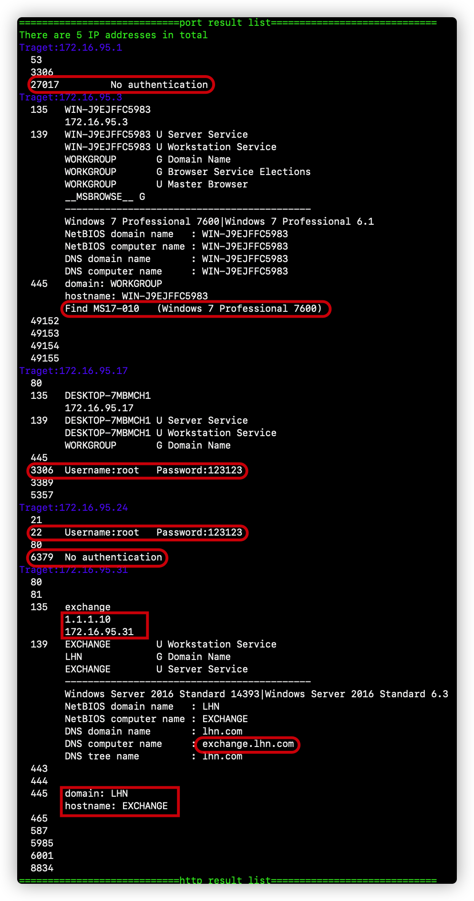
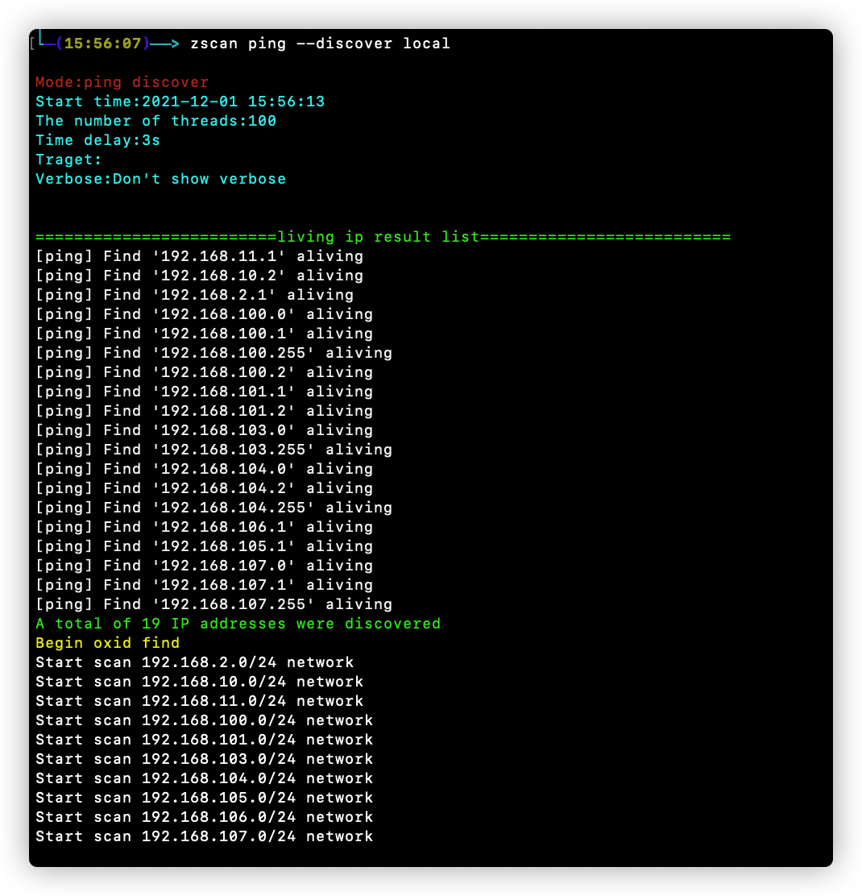
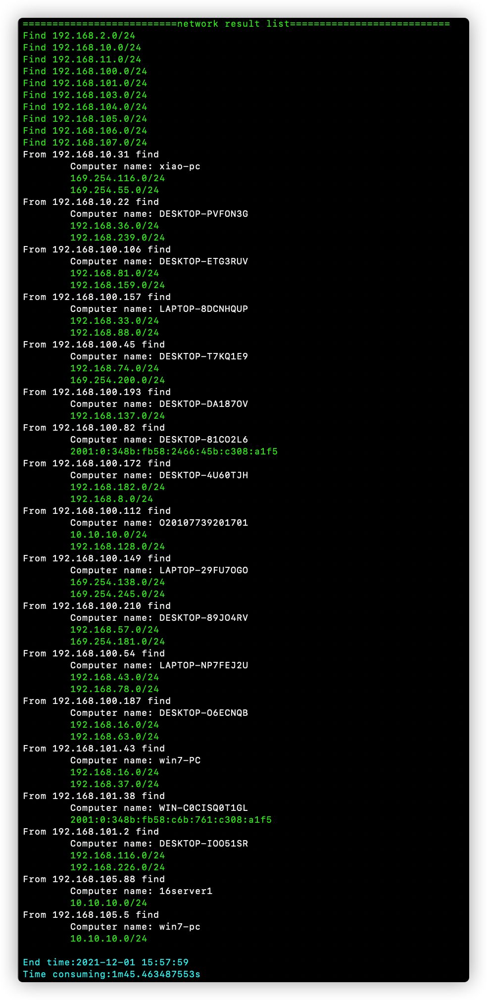
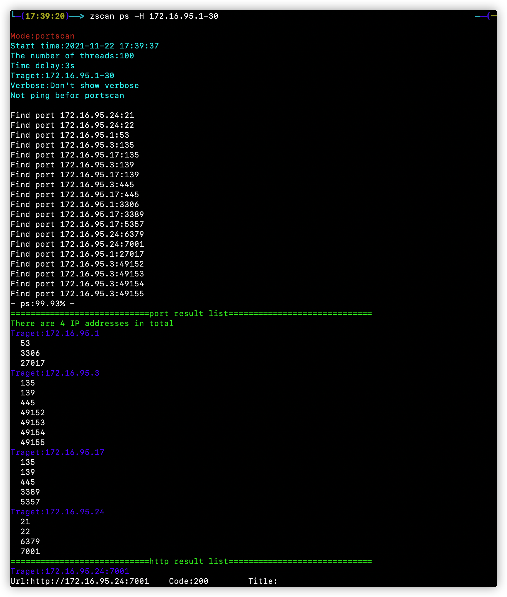
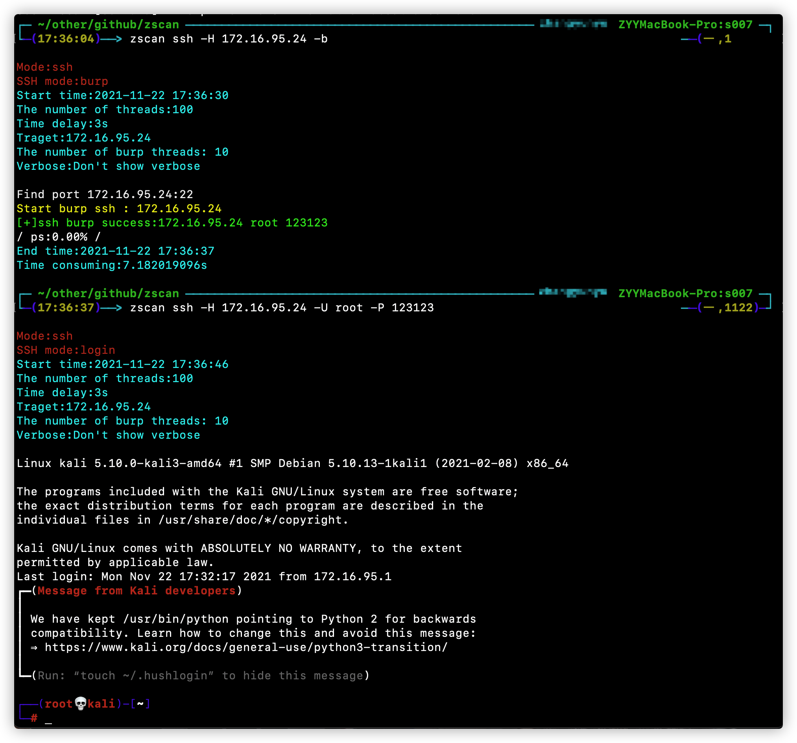
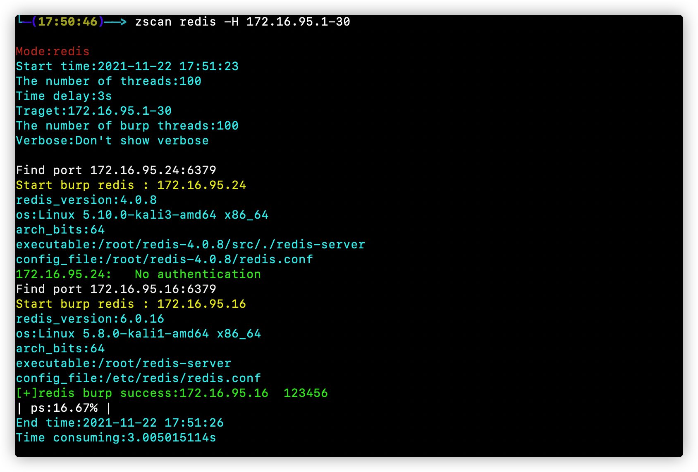
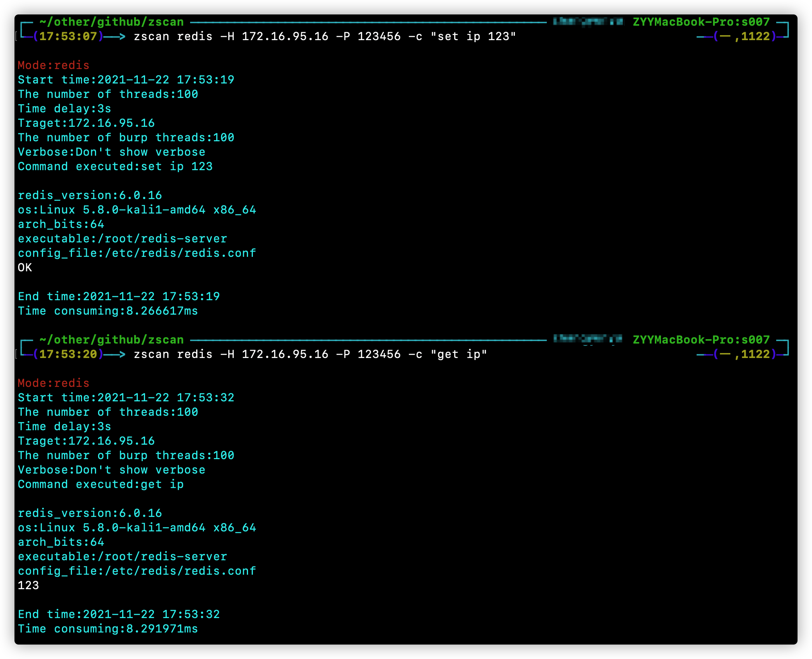
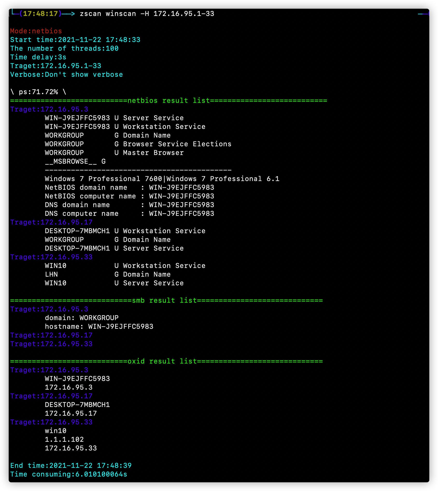
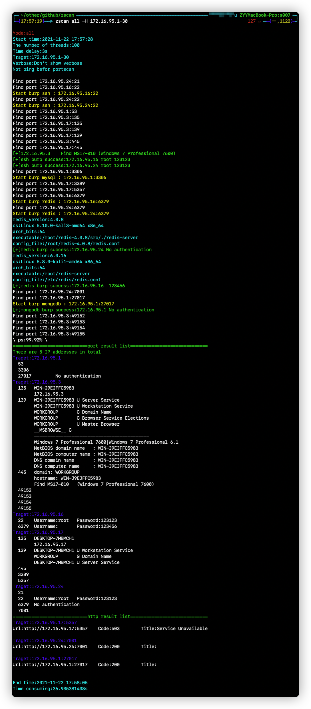

#              Zscan a scan blasting tool set
[](https://github.com/zyylhn/zscan/blob/master/LICENSE)
[](https://github.com/zyylhn/zscan/releases/tag/1.1.2)
[](https://github.com/zyylhn/zscan)

📄[中文文档](https://github.com/zyylhn/zscan/blob/master/README.md)


<details>
<summary><b>Result output format</b></summary>
-A partial screenshot of the output



</details>


## Introduce🎉


​	Zscan is an open source collection of Intranet port scanners, blasting tools, and other utilities. Based on host discovery and port scanning, you can blow up mysql, MSSQL, Redis, Mongo, Postgres, FTP, SSH and other services. Other scanning functions include NetBIOS, SMB, OXID, SOCKS Server (scanning proxy servers on the Intranet), SNMP, and MS17010. Each module has its own unique functions such as SSH, which also supports user name, password and public key login, and can execute commands after all services are blown up successfully. In addition to basic scanning and service blasting, ZScan integrates nc module (connect and listen), HTTPServer module (support for downloading files, uploading files, and authentication), SOcks5 module (start a proxy server). There is also the ALL module, which calls all the other scanning and blasting modules during the scan. Built-in proxy functionality.

The tool is bulky, and a condensed version will be published later

The format is

```
zscan module args
```

```
 ______     ______     ______     ______     __   __    
/\___  \   /\  ___\   /\  ___\   /\  __ \   /\ "-.\ \   
\/_/  /__  \ \___  \  \ \ \____  \ \  __ \  \ \ \-.  \  
  /\_____\  \/\_____\  \ \_____\  \ \_\ \_\  \ \_\\"\_\ 
  \/_____/   \/_____/   \/_____/   \/_/\/_/   \/_/ \/_/

Usage:
  zscan [module]

all module:
  all         Use all scan mode
  completion  generate the autocompletion script for the specified shell
  ftp         burp ftp username and password 
  help        Help about any command
  httpserver  Start an authentication HTTP server
  mongo       burp mongodb username and password
  ms17010     MS17_010 scan
  mssql       burp mssql username and password
  mysql       burp mysql username and password
  nc          A easy nc
  ping        ping scan to find computer
  postgres    burp postgres username and password
  proxyfind   Scan proxy
  ps          Port Scan
  redis       burp redis password
  snmp        snmp scan
  socks5      Create a socks5 server
  ssh         ssh client support username password burp
  version     Show version of zscan
  winscan     netbios、smb、oxid scan

Flags:
  -h, --help            help for zscan
      --log             Record the scan results in chronological order，Save path./log.txt
  -O, --output          Whether to enter the results into a file（default ./result.txt),can use --path set
      --path string     the path of result file (default "result.txt")
      --proxy string    Connect with a proxy(user:pass@172.16.95.1:1080 or 172.16.95.1:1080)
  -T, --thread thread   Set thread eg:2000 (default 100)
  -t, --timeout time    Set timeout(s) eg:5s (default 3s)
  -v, --verbose         Show verbose information
```
The Flags in the module represent the parameters of the current command, and the Global Flags represent Global parameters (all commands can be used).
Flags is a global parameter that can be used by all modules
- --log：Enabling this parameter will append the results of the current run to log.txt
- -O --output：Output the result as a file, in the current directory result. TXT by default (only the results of the current run are saved). The file path can be specified using --path
- --path：Specify the file path to save the result
- --proxy ：Set the proxy. The user name and password (user:pass@ip:port) do not require province authentication (ip:port).
- -T --thread：Specifies the number of threads. Default is 100
- -t --timeout：Set the delay, network conditions good pursuit of speed can be set to 1s
- -v --verbose：Display the scan process information

## Module😈

Existing modules：

<details>
<summary><b>ping:Ping is invoked for common users, and ICMP packets are used for root users</b></summary>


```
Usage:
  zscan ping [flags]

Flags:
  -d, --discover string   Live network segment found
  -h, --help              help for ping
  -H, --host hosts        Set hosts(The format is similar to Nmap)
      --hostfile string   Set host file
  -i, --icmp              Icmp packets are sent to check whether the host is alive(need root)

Global Flags:
 -h, --help            help for zscan
      --log             Record the scan results in chronological order，Save path./log.txt
  -O, --output          Whether to enter the results into a file（default ./result.txt),can use --path set
      --path string     the path of result file (default "result.txt")
      --proxy string    Connect with a proxy(user:pass@172.16.95.1:1080 or 172.16.95.1:1080)
  -T, --thread thread   Set thread eg:2000 (default 100)
  -t, --timeout time    Set timeout(s) eg:5s (default 3s)
  -v, --verbose         Show verbose information


```

You must specify one of the two parameters, host and hostfile. When you have root permission, you can use -i to send ICMP packets instead of calling the local ping command (if the thread is extremely high, calling the local ping command will cause high CPU usage).

add --discover find network
</details>

<details>
<summary><b>ps:Port scan and get httptitle</b></summary>


```
Usage:
  zscan ps [flags]

Flags:
  -b, --banner            Return banner information
  -h, --help              help for ps
  -H, --host hosts        Set hosts(The format is similar to Nmap) eg:192.168.1.1/24,172.16.95.1-100,127.0.0.1
      --hostfile string   Set host file
  -i, --icmp              Icmp packets are sent to check whether the host is alive(need root)
      --ping              Ping host discovery before port scanning
  -p, --port port         Set port eg:1-1000,3306,3389 

Global Flags:
      --log             Record the scan results in chronological order，Save path./log.txt
  -O, --output          Whether to enter the results into a file（default ./result.txt),can use --path set
      --path string     the path of result file (default "result.txt")
  -T, --thread thread   Set thread eg:2000 (default 100)
  -t, --timeout time    Set timeout(s) eg:5s (default 3s)
  -v, --verbose         Show verbose information
```

--host and --hostfile specify the target

-p Specify the port. If not, use the default port

--ping Ping host discovery before port scanning

--icmp Icmp packets are used for host discovery when ping is used

</details>

<details>
<summary><b>all:Call all scan and burst modules for scanning</b></summary>


```
Usage:
  zscan all [flags]

Flags:
  -h, --help              help for all
  -H, --host hosts        Set hosts(The format is similar to Nmap) eg:192.168.1.1/24,172.16.95.1-100,127.0.0.1
      --hostfile string   Set host file
  -i, --icmp              Icmp packets are sent to check whether the host is alive(need root)
      --passdict string   Set postgres passworddict path
  -P, --password string   Set postgres password
      --ping              Ping host discovery before port scanning
  -p, --port port         Set port eg:1-1000,3306,3389 

Global Flags:
      --log             Record the scan results in chronological order，Save path./log.txt
  -O, --output          Whether to enter the results into a file（default ./result.txt),can use --path set
      --path string     the path of result file (default "result.txt")
      --proxy string    Connect with a proxy(user:pass@172.16.95.1:1080 or 172.16.95.1:1080)
  -T, --thread thread   Set thread eg:2000 (default 100)
  -t, --timeout time    Set timeout(s) eg:5s (default 3s)
  -v, --verbose         Show verbose information

```

In essence, the ALL module is basically the same as the PS module, except that when the ALL module scans the corresponding port, it will conduct fingerprint identification or user name and password blasting in the current thread

The parameters of the ALL module are the same as those of the PS module. There is a password dictionary, which is used to set the dictionary when the port needs to be blown up. Other things are the same

</details>

<details>
<summary><b>ssh:Username and password blasting, SSH username and password login, public key login</b></summary>


```
Usage:
  zscan ssh [flags]

Flags:
  -b, --burp              Use burp mode default login mode
  -h, --help              help for ssh
  -H, --host string       Set ssh server host
      --hostfile string   Set host file
  -d, --keypath string    Set public key path
  -k, --login_key         Use public key login
      --passdict string   Set ssh passworddict path
  -P, --password string   Set ssh password
  -p, --port int          Set ssh server port (default 22)
      --userdict string   Set ssh userdict path
  -U, --username string   Set ssh username

Global Flags:
      --log             Record the scan results in chronological order，Save path./log.txt
  -O, --output          Whether to enter the results into a file（default ./result.txt),can use --path set
      --path string     the path of result file (default "result.txt")
  -T, --thread thread   Set thread eg:2000 (default 100)
  -t, --timeout time    Set timeout(s) eg:5s (default 3s)
  -v, --verbose         Show verbose information
```

Login module (default)

​	username password login:./zscan ssh -H 172.16.95.24 -U root -P 123456

​	A public key to login:./zscan ssh -H 172.16.95.24 -U root -k

​	 You can use -d/--keypath to specify the path of the private key,default, public key login uses  ./ssh under the current user directory to obtain the private key.

Blasting module (-b/--burp parameters)

​	username:can use -U/--username specify user name、--userdict specify the user name dictionary and do not specify the use of internal user names（admin，root）

​	password:can use -P/--password specify passworld、--passdict specifies a password file and does not specify the use of an internal password dictionary

​	eg:./zscan_linux ssh -H 172.16.95.1-30 -U root -b --passdict 1.txt

</details>

<details>
<summary><b>mysql/mssql/mongo/redis/postgres/ftp:Username password blasting and execute simple commands</b></summary>

Take mysql for example, the operation of the database is basically the same


```
Usage:
  zscan mysql [flags]

Flags:
      --burpthread int    Set burp password thread(recommend not to change) (default 100)
  -c, --command string    Set the command you want to sql_execute
  -h, --help              help for mysql
  -H, --host string       Set mysql server host
      --hostfile string   Set host file
      --passdict string   Set mysql passworddict path
  -P, --password string   Set mysql password
  -p, --port int          Set mysql server port (default 3306)
      --userdict string   Set mysql userdict path
  -U, --username string   Set mysql username

Global Flags:
      --log             Record the scan results in chronological order，Save path./log.txt
  -O, --output          Whether to enter the results into a file（default ./result.txt),can use --path set
      --path string     the path of result file (default "result.txt")
  -T, --thread thread   Set thread eg:2000 (default 100)
  -t, --timeout time    Set timeout(s) eg:5s (default 3s)
  -v, --verbose         Show verbose information
```

There is a new thread parameter called burptheard. This thread is different from the -t thread, which represents the number of targets that we scan concurrently (this target is a combination of IP and port, and each concurrency is equivalent to sending a packet to the target). Burptheard stands for when we find our target port in the single thread of the above concurrent scanning, such as mysql, it will start a multi-thread blasting in the current scanning thread (here the target is changed to a specific PORT of a specific IP address, so speed limiting is required here, too fast speed may cause the target service to be unavailable).

You can use -c to specify the command to execute

</details>

<details>
<summary><b>proxyfind:Scan the proxy in the network, currently support SOCKS4/5, later add HTTP</b></summary>


```
Usage:
  zscan proxyfind [flags]

Flags:
  -h, --help              help for proxyfind
  -H, --host hosts        Set hosts(The format is similar to Nmap) eg:192.168.1.1/24,172.16.95.1-100,127.0.0.1
      --hostfile string   Set host file
  -p, --ports port        Set port eg:1-1000,3306,3389 (default "1080,1089,8080,7890,10808")
      --type string       Set the scan proxy type(socks4/socks5/http) (default "socks5")

Global Flags:
      --log             Record the scan results in chronological order，Save path./log.txt
  -O, --output          Whether to enter the results into a file（default ./result.txt),can use --path set
      --path string     the path of result file (default "result.txt")
  -T, --thread thread   Set thread eg:2000 (default 100)
  -t, --timeout time    Set timeout(s) eg:5s (default 3s)
  -v, --verbose         Show verbose information
```

Scan the proxy server on the Intranet

-H specifies the target, -p specifies the port, --type specifies the proxy protocol type for scanning (currently supports SOckS4/5, other protocols are in progress)
</details>

<details>
<summary><b>ms17010:ms17010 Vulnerability batch scanning</b></summary>

```
Usage:
  zscan ms17010 [flags]

Flags:
  -h, --help              help for ms17010
  -H, --host string       Set target
      --hostfile string   Set host file

Global Flags:
      --log             Record the scan results in chronological order，Save path./log.txt
  -O, --output          Whether to enter the results into a file（default ./result.txt),can use --path set
      --path string     the path of result file (default "result.txt")
  -T, --thread thread   Set thread eg:2000 (default 100)
  -t, --timeout time    Set timeout(s) eg:5s (default 3s)
  -v, --verbose         Show verbose information
```

Just specify the target
</details>

<details>
<summary><b>snmp:snmp scan</b></summary>
```
Usage:
  zscan snmp [flags]
```
Flags:
      --burpthread int        Set burp password thread(recommend not to change) (default 100)
      --get string            set an oid
  -h, --help                  help for snmp
  -H, --host string           Set target
      --hostfile string       Set host file
  -l, --listoid               List commonly used OIDs
      --password string       set a password (default "public")
      --passwordfile string   passwords dict file, eg: ./dict/password.txt
  -p, --port port             Set port (default 161)
      --version string        specifies SNMP version to use. 1|2c|3  (default "2c")
      --walk string           set an oid
```
Global Flags:
      --log             Record the scan results in chronological order，Save path./log.txt
  -O, --output          Whether to enter the results into a file（default ./result.txt),can use --path set
      --path string     the path of result file (default "result.txt")
  -T, --thread thread   Set thread eg:2000 (default 100)
  -t, --timeout time    Set timeout(s) eg:5s (default 3s)
  -v, --verbose         Show verbose information
```

--listoid This section lists common query information

0: 系统基本信息         SysDesc                 GET     1.3.6.1.2.1.1.1.0
1: 监控时间             sysUptime               GET     1.3.6.1.2.1.1.3.0
2: 系统联系人           sysContact              GET     1.3.6.1.2.1.1.4.0
3: 获取机器名           SysName                 GET     1.3.6.1.2.1.1.5.0
4: 机器所在位置         SysLocation             GET     1.3.6.1.2.1.1.6.0
5: 机器提供的服务       SysService              GET     1.3.6.1.2.1.1.7.0
6: 系统运行的进程列表   hrSWRunName             WALK    1.3.6.1.2.1.25.4.2.1.2
7: 系统安装的软件列表   hrSWInstalledName       WALK    1.3.6.1.2.1.25.6.3.1.2
8: 网络接口列表         ipAdEntAddr             WALK    1.3.6.1.2.1.4.20.1.1


Queries can be made by using --walk and --get

If the password is not specified, public is used by "default"

</details>

<details>
<summary><b>winscan:Includes OXID, SMB, NETBIOS scanning functions</b></summary>

```
Usage:
  zscan winscan [flags]

Flags:
  -h, --help              help for winscan
  -H, --host string       Set target
      --hostfile string   Set host file
      --netbios           netbios scan
      --oxid              oxid scan
      --smb               smb scan

Global Flags:
      --log             Record the scan results in chronological order，Save path./log.txt
  -O, --output          Whether to enter the results into a file（default ./result.txt),can use --path set
      --path string     the path of result file (default "result.txt")
  -T, --thread thread   Set thread eg:2000 (default 100)
  -t, --timeout time    Set timeout(s) eg:5s (default 3s)
  -v, --verbose         Show verbose information
```

Netbios, OXID, SMB are scanned simultaneously if given directly to the target. You can use -- to specify that only one is used

</details>

<details>
<summary><b>nc:A simple nc, can start the port to connect the port</b></summary>

```
zscan nc
```

```
Usage:
  zscan nc [flags]

Flags:
  -a, --addr string   listen/connect host address eg(listen):-a 0.0.0.0:4444  eg(connect):-a 172.16.95.1:4444
  -h, --help          help for nc
  -l, --listen        listen mode(default connect)

Global Flags:
      --log             Record the scan results in chronological order，Save path./log.txt
  -O, --output          Whether to enter the results into a file（default ./result.txt),can use --path set
      --path string     the path of result file (default "result.txt")
  -T, --thread thread   Set thread eg:2000 (default 100)
  -t, --timeout time    Set timeout(s) eg:5s (default 3s)
  -v, --verbose         Show verbose information

```

-a specifies the address. If -l is not used, it indicates the connection target. If -l is used, it indicates the listening port

</details>

<details>
<summary><b>socks5:Start a SOcks5 server</b></summary>

```
Usage:
  zscan socks5 [flags]

Flags:
  -a, --addr string       Specify the IP address and port of the Socks5 service (default "0.0.0.0:1080")
  -h, --help              help for socks5
  -P, --password string   Set the socks5 service authentication password
  -U, --username string   Set the socks5 service authentication user name

Global Flags:
      --log             Record the scan results in chronological order，Save path./log.txt
  -O, --output          Whether to enter the results into a file（default ./result.txt),can use --path set
      --path string     the path of result file (default "result.txt")
  -T, --thread thread   Set thread eg:2000 (default 100)
  -t, --timeout time    Set timeout(s) eg:5s (default 3s)
  -v, --verbose         Show verbose information

```

You can use -a to specify the IP address and port that the Socks5 service listens to

-p and -u specify the user name and password of the proxy

</details>

<details>
<summary><b>httpserver:Start an HTTP server that supports identity authentication and file uploading</b></summary>

```
Usage:
 zscan httpserver [flags]

Flags:
  -a, --addr string   set http server addr (default "0.0.0.0:7001")
  -d, --dir string    set HTTP server root directory (default ".")
  -h, --help          help for httpserver
  -P, --pass string   Set the authentication password
  -U, --user string   Set the authentication user

Global Flags:
      --log             Record the scan results in chronological order，Save path./log.txt
  -O, --output          Whether to enter the results into a file（default ./result.txt),can use --path set
      --path string     the path of result file (default "result.txt")
  -T, --thread thread   Set thread eg:2000 (default 100)
  -t, --timeout time    Set timeout(s) eg:5s (default 3s)
  -v, --verbose         Show verbose information
```


Currently, open a simple HTTP server that can only browse and download files and authenticate, but not upload files

-a specifies the linsten IP address and address

-d specifies whether the HTTPServer is enabled

-P and -U Set the user name and password for authentication
</details>

## Use the sample🤪

<details>
<summary><b>ping:zscan ping --discover local</b></summary>

```
zscan ping --discover local 
or use zscan ping --discover 192.168.0.0
```




</details>

<details>
<summary><b>ps:zscan ps -H ip</b></summary>

```
zscan ps -H 172.16.95.1-30 
```



</details>

<details>
<summary><b>ssh:zscan ssh -H ip -b/zscan ssh -H ip -U user -P pass </b></summary>

```
burp zscan ssh -H 172.16.95.24 -b
login zscan ssh -H 172.16.95.24 -U root -P 123123
```



</details>

<details>
<summary><b>redis:zscan redis -H ip/zscan redis -H ip -c cmd</b></summary>

```
burp zscan redis -H 172.16.95.1-30
login zscan redis -H 172.16.95.16 -c cmd
```





</details>

<details>
<summary><b>winscan:zscan winscan -H ip</b></summary>

```
zscan winscan -H 172.16.95.1-33
```



</details>

<details>
<summary><b>all:zscan all -H ip</b></summary>

```
zscan all -H 172.16.95.1-30
```



</details>

## Tool edge🚀

- The command is simple and convenient, and the function of the module is simple and clear, which is convenient to expand and add various new functions
- Not just a scanner, but also integrated with a variety of common utility features, built-in proxy capabilities, can be called a toolkit
- Port scanning and blasting are seamlessly connected, greatly improving the scanning speed: This advantage is fully reflected in the ALL module. In the process of multi-threaded port scanning, open ports will be judged. If a port can be blasted, another multi-thread will be immediately opened in the current thread for blasting. Significantly increase speed. The procedure of obtaining open port before blasting is reduced
- Beautiful and easy to read output format: through color differentiation, not only output during the process, but also generate scan results at the end of the scan, showing all scan and blasting results during the process（[introduce](https://github.com/zyylhn/zscan#简介)）,and support to record the scan results to a file
- Not only can the service be blasted, but the command can be executed successfully
- Under development, if you find any problems or bugs, or any novel and interesting functional requirements can contact me

## Build👨

```
go get github.com/zyylhn/zscan
go bulid
```

## Disclaimer🧐

This tool is only for legally authorized enterprise security construction activities. If you need to test the availability of this tool, please build your own target environment.

When using this tool for testing, ensure that you comply with local laws and regulations and that you have obtained sufficient authorization. Do not scan unauthorized targets.

If you have any illegal behavior during the use of the tool, you shall bear the corresponding consequences by yourself, and we will not assume any legal and joint liability.

Before installing and using this tool, you must carefully read and fully understand the contents of each clause. Restrictions, disclaimers or other clauses that involve your significant rights and interests may be highlighted in bold or underlined. Do not install and use this tool unless you have fully read, fully understand and accept all terms of this agreement. Your use of this Agreement or your acceptance of this Agreement in any other way, express or implied, shall be deemed that you have read and agreed to be bound by this Agreement.

## Reference linking👀

https://github.com/shadow1ng/fscan

https://github.com/k8gege/LadonGo

## Update progress💪

### Module

- [x] ping：Ping Host Discovery
    - [x] Calling system ping
    - [x] Sending ICMP Packets
    - [x] Network segment discovery
      - [x] Ping Network segment B gateway
      - [x] oxid scan

- [x] ps Port scanning module
    - [x] Get the HTTP title and status code
    - [ ] Perform a simple HTTP directory scan
    - [x] Return banner message
    - [x] First ping again

- [x] nc
    - [x] Listening port function
    - [x] Connect port function

- [x] socks
    - [x] User name and password authentication

- [x] proxyfind
    - [x] socks4/5Proxy Server Scanning
    - [ ] http Proxy Server Scanning

- [x] httpserver Enable the HTTP server module
    - [x] Identity authentication
    - [ ] File upload function

- [x] ssh
    - [x] User name and password login (interactive)
    - [x] Key login feature (interactive)
    - [x] SSH account password blasting function

- [x] ftp
    - [x] User name and password blasting function
    - [ ] Run the command Function

- [x] mysql
    - [x] User name and password blasting function
    - [x] Run the command Function

- [x] mssql
    - [x] User name and password blasting function
    - [x] Run the command Function

- [x] mongo
    - [x] User name and password blasting function
    - [x] Run the command Function

- [x] redis
    - [x] User name and password blasting function
    - [ ] A master-slave replication rce 
    - [x] Run the command Function

- [x] postgres
    - [x] User name and password blasting function
    - [x] Run the command Function

- [x] winscan@https://github.com/shenzhibuqins
    - [x] smb scan
    - [x] oxid scan
    - [x] netbios scan

- [x] snmp@https://github.com/shenzhibuqin

- [x] 17010 scan

- [ ] wmi

- [ ] ldap

- [x] version
    - [ ] The current version and the latest version are output

    - [ ] Update to the latest version

- [ ] ..........

### Tool functions

- [x] Output results to a file
- [x] Log function to record the results of each run
- [x] Set thread function (scanning support for ultra high thread)
- [x] Setting the Timeout function
- [x] The agent function
    - [ ] Udp proxy function
    - [x] Tcp proxy function
    - [x] Service blasting and command execution proxy function
        - [x] mysql
        - [ ] mssql
        - [x] redis
        - [ ] mongodb
        - [ ] postgres
        - [x] ssh
        - [x] ftp
- [x] Read target functionality from a file
- [x] Blasting support for oversized dictionaries
- [ ] ...........

### The late goal

- [ ] Improve the current version of the server blasting module, support more commands, as far as possible to achieve barrier-free command use,And add the database utilization module (after blasting the successful database utilization)
    - [ ] Mysql
    - [ ] Mssql
    - [ ] Postgres
    - [ ] Mongodb
    - [ ] Ftp
- [ ] A lite version of zscan
    - [ ] Remove all database drivers to reduce volume at the cost of not being able to execute commands
    - [ ] Remove the cobra framework, the framework itself is bulky
    - [ ] Remove database modules that are not used or not used
  
